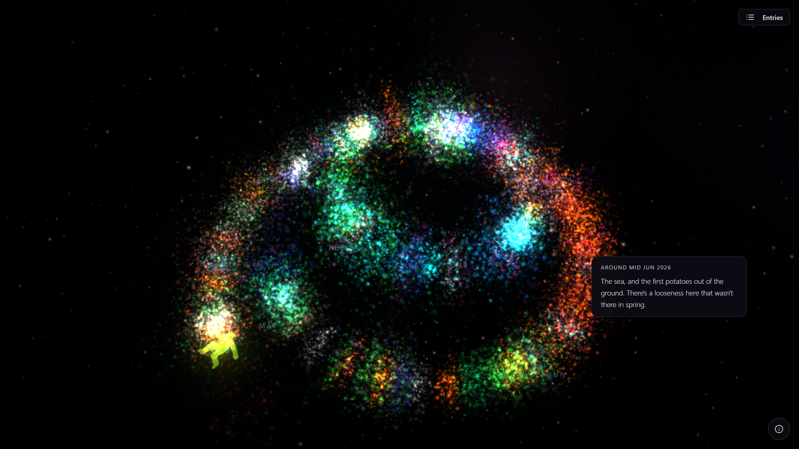
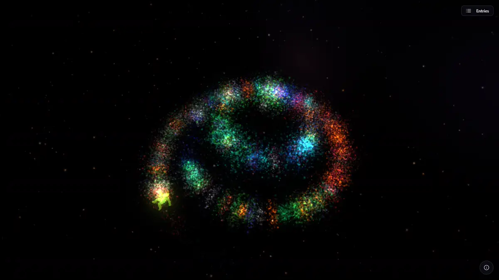
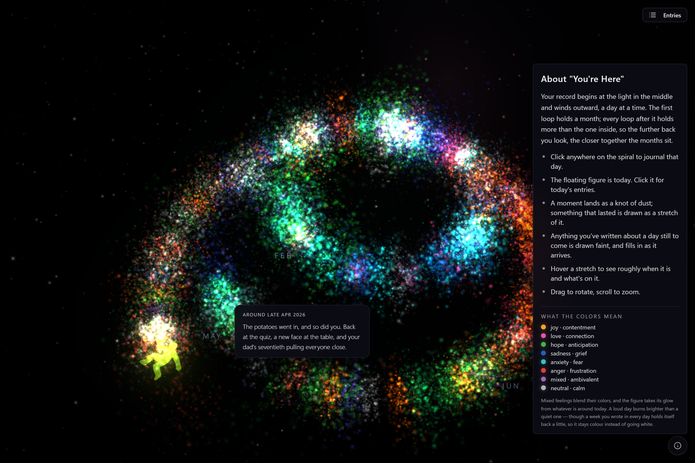

# You're Here

A reflective journal that turns how your days felt into something you can see. Looking back, memory flattens a stretch of time into "it was all bad" or "it was all good". You're Here shows the whole picture instead, so a hard moment sits next to everything else that was going on around it. It's a tool for seeing, not solving: it happened, it passed, and you're here.

It's inspired by a memory exercise in David Burns' *Feeling Good*. Try to step back into a moment when you felt particularly bad or surprisingly good, and usually you can't. There's a gap between what you felt and what you recall, and that gap is worth looking at.

You write an entry, or speak it if you prefer, and pin it to a day. Gemini reads how it felt and how long the feeling lasted, whether that's a single day, a stretch of weeks or something you're dreading next month. The entry then appears as a cloud of coloured dust on a 3D spiral of your days. You never pick a mood, a colour or an end date.

> **Runs locally, with your own API keys.** There is no backend: entries live in your browser's storage. The only things that leave your machine are the entry text, sent to Gemini for analysis, and voice recordings, sent to Groq if you use the mic.



<sub>Screenshots use the fictional demo record in [demo-content/](demo-content/), which loads on your first visit.</sub>

---

## What the AI Does

The spiral's colors, intensity, and shape are never chosen by you. They're derived by AI from your writing. You just think out loud.

### Sentiment Analysis
When you submit an entry, Gemini analyzes your text for emotional content. It handles nuance: *"I keep telling myself it's fine but I can't sleep"* is anxiety, not positivity. Mixed emotions are valid: joy and sadness can coexist, and the spiral shows that through blended colors.

| What you feel | How it looks |
|---|---|
| Joy, contentment | Warm yellows, oranges |
| Sadness, grief | Deep blues |
| Anger, frustration | Reds |
| Anxiety, fear | Cool teals, cyans |
| Love, connection | Warm pinks, magentas |
| Hope, anticipation | Greens |
| Mixed, ambivalent | Blended purples |
| Neutral, calm | Soft whites, grays |



### AI-Defined Time Periods
You only ever pick *one* date: the anchor, where the entry lives on the spiral. Gemini reads your text and decides how far that feeling actually stretches:

- *"today I felt..."* → a single point on the spiral
- *"since that day I've been..."* → a colored smear from the anchor to today
- *"for the past two weeks..."* → smear pulled across the implied window
- *"until the move next Friday..."* → smear that ends when the event ends
- *"next month I'm nervous about..."* → diffuse, ghostly particles projected into the future

You don't pick start/end dates. You don't classify anything as "past" or "future." The model infers the temporal scope (`point`, `smear`, or `forward`) and the end date from your wording. Anything beyond today renders lighter and more transparent. The future is ghostly, the past is vivid.

### The Now Anchor
A small floating figure marks **today** on the spiral, the "you are here" pin that gives the project its name. Wherever you orbit the camera, the figure stays facing you so you can always tell where the present is. The spiral starts at the centre with your first entry and winds outward and down, one day at a time, so the past sits inward and above you and forward projections drift ahead along the curve.

### Region Summaries
Hover over any part of the spiral and the AI writes a warm, observational summary of that stretch: the early, mid or late part of the month, including any feeling that runs through it. Each summary is kept in your browser and reused until the entries in that stretch change, so it reads the same every time and appears instantly after the first hover.

### Speech-to-Text *(optional)*
Hit the microphone button and speak. Whisper transcribes your voice into text, so you can journal by thinking out loud, literally. Without a Groq key the mic still records, but nothing is transcribed; typing works as normal.

---

## Getting Started

Requires Node 20+.

```sh
git clone https://github.com/tuirk/you-are-here.git
cd you-are-here
npm install
cp .env.example .env   # add your API keys
npm run dev
```

Open [http://localhost:5174](http://localhost:5174).

### Environment Variables

| Variable | Required | Description |
|---|---|---|
| `VITE_GEMINI_API_KEY` | Recommended | [Gemini API key](https://aistudio.google.com/apikey) for sentiment + temporal analysis and region summaries |
| `VITE_GROQ_API_KEY` | Optional | [Groq API key](https://console.groq.com) for Whisper speech-to-text |

> **Don't deploy a build with your keys in it.** Vite writes every `VITE_*` variable into the built JavaScript, so anyone who can load a hosted `dist/` can read your keys. Run it locally with `npm run dev`.

**Running without a Gemini key:** the app still works — you can place entries on the spiral and read them back in the journal — but each entry renders as a plain grey cloud at its anchor date. No color, no smear, no forward projection, no region summaries. Gemini is what turns the spiral into a map; without it, you get a plain timeline with text attached.

### Known Limitations

- **Your journal lives in one browser.** Entries are stored in `localStorage`: clearing site data or switching browsers loses them, and there is no export yet.
- **The mic needs a Groq key.** Without one it still records, but nothing is transcribed.
- **WebGL is required**, and the app has only been tested in Chrome.
- **Gemini is the only analysis provider.** Without a key the spiral stays grey. Entries that couldn't be analysed (no key, no network) are retried the next time the app opens with a key.

### Development Checks

```bash
npm run verify      # typecheck + lint + tests, the full gate
```

Or individually:

| Command | What it checks |
|---|---|
| `npm run typecheck` | `tsc -b --noEmit` |
| `npm run lint` | ESLint, expected to stay at zero problems |
| `npm test` | Vitest unit suite |
| `npm run test:watch` | Vitest in watch mode |
| `npm run test:e2e` | Playwright browser suite (starts the dev server itself) |
| `npm run test:e2e:headed` | Same, with a visible browser |

**About the tests.** The particle visualization is the point of this project, and its
worst failure mode is silent: a single `NaN` in a position buffer makes Three.js drop
an entire cluster with nothing in the console. The suite is built around that risk.

- `utils/daily/*.test.ts`: the spiral coordinate math that places every particle,
  marker and line. Covers where day 0 sits, how each revolution grows the radius
  and descends, and that no input produces a non-finite coordinate.
- `components/spiral/particles/ParticleGenerator.test.ts`: asserts the generated
  `Float32Array` buffers are correctly sized, entirely finite across every
  layer/intensity/date-precision combination, visible (positive size and opacity),
  and tinted by the requested colour.
- `components/spiral/particles/DustParticle.test.ts`: per-particle colour variation
  must shift saturation and lightness but never hue, or a cluster drifts off its
  sentiment colour.
- `utils/colorMapping.test.ts`: pins the sentiment palette and blending rules.
- `utils/storage.test.ts`: localStorage is the only place a journal exists; these
  cover round-trips and recovery from corrupt or partial data.

Pure-logic suites run in the `node` environment; the few needing DOM or
`localStorage` opt in with a `@vitest-environment jsdom` docblock.

**Browser tests** (`e2e/spiral.spec.ts`) cover what unit tests structurally cannot.
Every buffer can be perfectly finite and the scene can still come up black: a
broken shader, a lost WebGL context, an R3F upgrade that stops mounting children.
None of that throws. So these tests decode the actual screenshot and count pixels:
at least 1.5% of the frame must be lit and at least 0.8% *saturated*, where saturation
is what distinguishes the coloured emotional clusters from the white starfield behind them.

The suite runs serially with one worker on purpose. Under software rendering,
parallel specs exhaust WebGL contexts and later ones silently produce blank frames,
which looks exactly like the regression the tests exist to catch.

Playwright needs its browsers. If they live outside the default location, point
`PLAYWRIGHT_BROWSERS_PATH` at them; otherwise run `npx playwright install chromium`.

---

## Tech Stack

| | |
|---|---|
| **App** | React 18, TypeScript, Vite |
| **3D** | Three.js via React Three Fiber and drei, with postprocessing for bloom and vignette |
| **UI** | Tailwind CSS, Radix primitives via shadcn/ui |
| **AI** | Gemini 2.5 Flash-Lite for sentiment, time span and region summaries; Whisper large-v3 via Groq for optional speech-to-text |
| **Storage** | Browser `localStorage`, no backend |
| **Tests** | Vitest (unit), Playwright (browser, reads pixels from real screenshots) |

---

## License

[MIT](LICENSE) © 2026 tuirk
